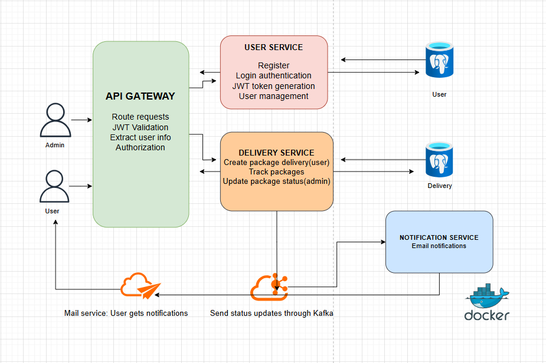

# 📦 Package Delivery and Tracking System

A Spring Boot based microservices application that allows users to register, create package deliveries, and track their packages via unique delivery numbers. Admins can update delivery statuses, and users receive real-time email notifications.

---

## Tech Stack

- Java 17
- Spring Boot (Security, Data JPA)
- Gradle
- JWT
- PostgreSQL
- Lombok
- Kafka (asynchronous messaging)
- Mail API (JavaMailSender)
- Spring Cloud Gateway
- Docker
- Docker Compose

---

## Microservices Overview

| Service             | Description                                                                 |
|---------------------|-----------------------------------------------------------------------------|
| API Gateway         | Routes external requests to appropriate services, handles JWT validation.   |
| User Service        | User registration and authentication (roles: `USER`, `ADMIN`).              |
| Delivery Service    | Users can create packages with destination info and track them.             |
| Notification Service| Sends email notifications when a delivery is created.                      |

---

## Features

- Register as `USER` or `ADMIN`
- Login to get a JWT token via `/login`
- Create delivery: destination address + recipient email
- Automatically generate package tracking number
- Receive email when delivery is successfully created
- Admin can update the delivery status (e.g., PENDING → SHIPPED → DELIVERED)
- Services communicate asynchronously via Kafka
